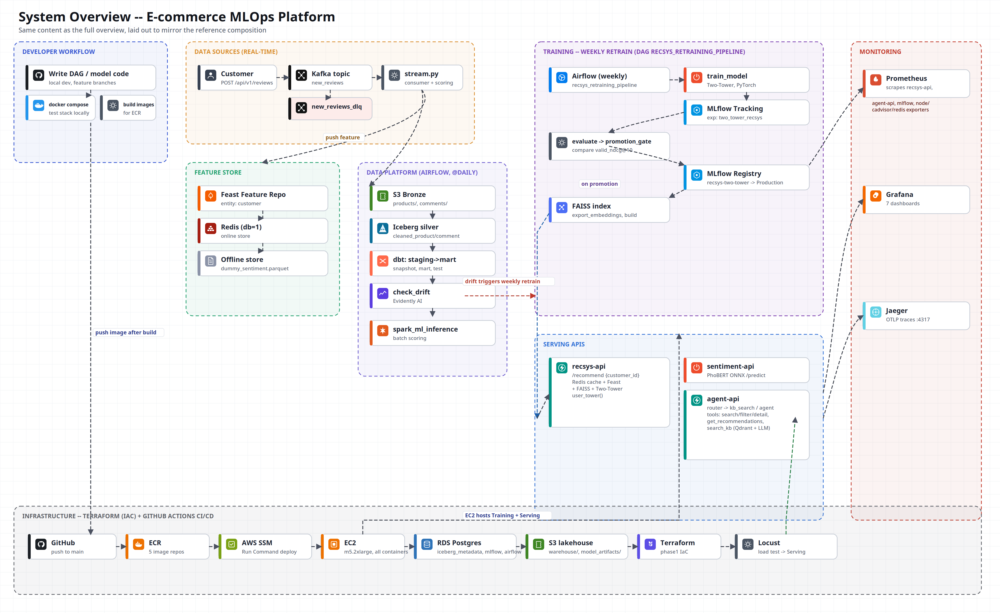
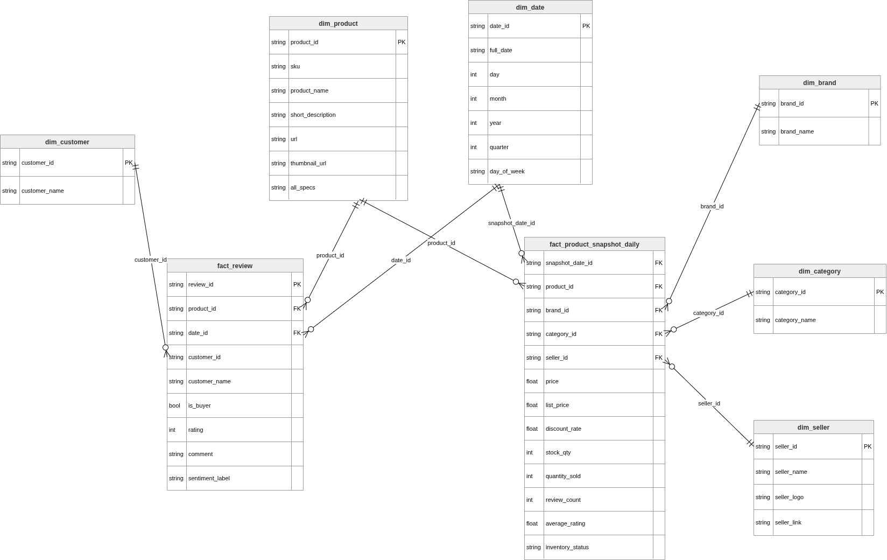
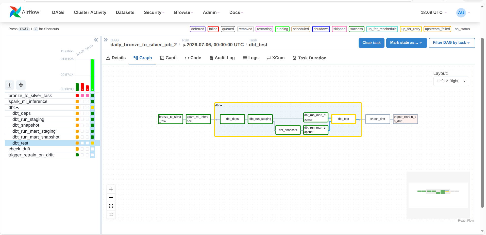
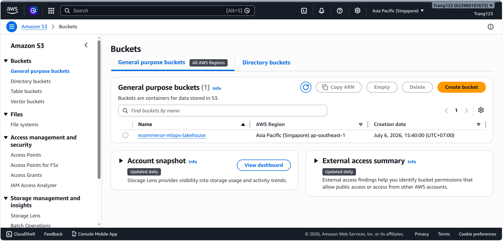
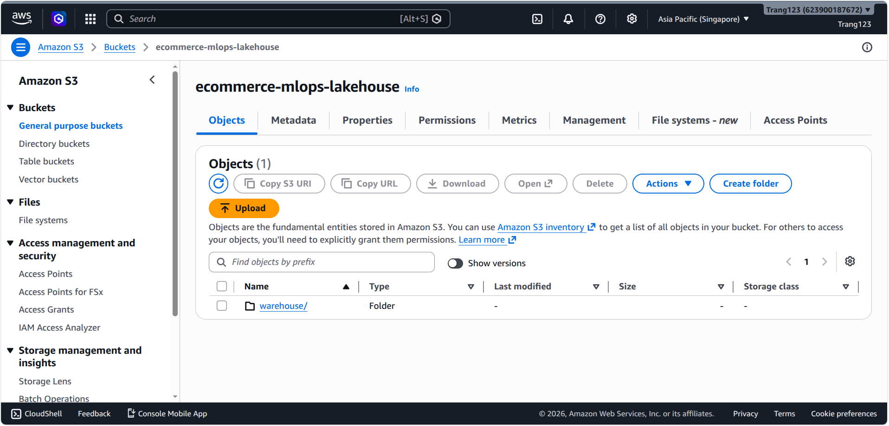
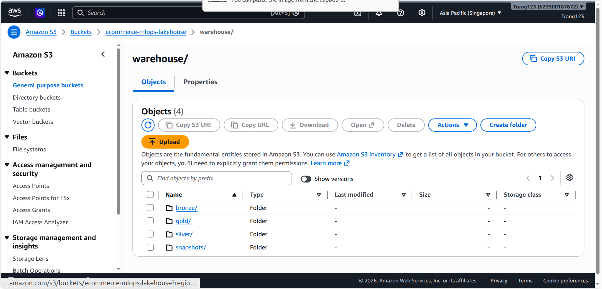

# **E-commerce AI Platform — RecSys + LLM Shopping Agent, End-to-end MLOps**

- [**E-commerce AI Platform — RecSys + LLM Shopping Agent, End-to-end MLOps**](#e-commerce-ai-platform--recsys--llm-shopping-agent-end-to-end-mlops)
  - [I. Overview](#i-overview)
  - [II. Project Structure](#ii-project-structure)
  - [III. Data Pipeline — Crawl → Kafka → Spark/Iceberg → dbt](#iii-data-pipeline--crawl--kafka--sparkiceberg--dbt)
  - [IV. Feature Store \& ML Training](#iv-feature-store--ml-training)
  - [V. Deploy Serving Services (Docker Compose)](#v-deploy-serving-services-docker-compose)
  - [VI. Deploy the LLM Shopping Agent (LangGraph + RAG + vLLM)](#vi-deploy-the-llm-shopping-agent-langgraph--rag--vllm)
  - [VII. Deploy Infrastructure on AWS using Terraform](#vii-deploy-infrastructure-on-aws-using-terraform)
  - [VIII. CI/CD with GitHub Actions](#viii-cicd-with-github-actions)
  - [IX. Observability — Prometheus, Grafana, Jaeger](#ix-observability--prometheus-grafana-jaeger)
  - [X. Evaluation — RAGAS \& DeepEval](#x-evaluation--ragas--deepeval)

## I. Overview

An end-to-end MLOps platform for e-commerce, built solo around a real dataset
crawled from Tiki: a product/review crawler feeds Kafka, Spark + Iceberg build a
lakehouse, dbt models the Gold layer, PhoBERT scores sentiment, a Two-Tower/SASRec/
LTR ensemble ranks recommendations, FastAPI serves everything, and a hand-built
**LangGraph shopping agent (RAG + tool calling)**, served through **vLLM on a
real AWS GPU instance**, answers customer questions — all provisioned with
Terraform and shipped through GitHub Actions CI/CD.

<!-- ảnh demo tổng quan / video walkthrough: sẽ update sau -->



**Technology:**
* Source control: Git/GitHub
* CI/CD: GitHub Actions (OIDC → ECR → SSM rolling deploy, no static AWS keys)
* Build API: FastAPI
* Containerize application: Docker / Docker Compose
* Streaming: Apache Kafka (4 topics + dead-letter queue)
* Data lakehouse: Apache Spark 3.4, Apache Iceberg, dbt, Great Expectations
* Feature store: Feast (Redis online, Parquet/Iceberg offline)
* Vector retrieval: FAISS, Qdrant
* Cache: Redis (2-level cache + semantic cache for the agent)
* Orchestration: Apache Airflow
* Observability: Prometheus, Grafana, Jaeger (OpenTelemetry), DCGM Exporter (GPU)
* Infrastructure as Code: Terraform (VPC, EC2, GPU Spot, IAM/OIDC, Security Groups)
* Cloud platform: Amazon Web Services (EC2, S3, ECR, RDS, Secrets Manager)
* LLM serving: **vLLM** (GPU, OpenAI-compatible API, PagedAttention + continuous batching, AWQ quantization)

**Machine Learning Models:**
* Sentiment: [PhoBERT](https://huggingface.co/vinai/phobert-base) fine-tuned on real Vietnamese Tiki reviews, exported to ONNX
* Retrieval: Two-Tower (PyTorch, InfoNCE loss + in-batch negatives)
* Session-based: SASRec (self-attention transformer over purchase sequences)
* Reranking: XGBoost LambdaMART (LTR) + an explicit weighted multi-signal ensemble blend
* RAG embedding: [Vietnamese Embedding Model](https://huggingface.co/dangvantuan/vietnamese-embedding) + cross-encoder reranker
* Agent LLM: Qwen2.5-7B-Instruct-AWQ served via vLLM on GPU

**Data Source:**
* Real Tiki e-commerce data, self-crawled with Scrapy: products, reviews, and categories across many product lines
* Fully processed into a Gold-layer star schema ready for both recommendation training and analytics

---

## II. Project Structure

```txt
├── src/
│   ├── crawler/
│   ├── data_pipeline/
│   │   ├── jobs/
│   │   ├── quality/
│   │   ├── streaming/
│   │   │   ├── producer/
│   │   │   └── consumer/
│   │   └── spark/
│   ├── feature_store/
│   ├── ml_models/
│   │   ├── nlp/
│   │   └── recsys/
│   └── serving/
│       ├── nlp_api/
│       ├── recsys_api/
│       ├── agent_api/
│       └── streamlit_app/
├── dbt_project/
├── airflow/dags/
├── terraform/
├── docker/
├── monitoring/
├── kb-docs/
├── docs/
├── docker-compose.infra.yml
├── docker-compose.app.yml
├── docker-compose.batch_dev.yml
└── docker-compose.monitor.yml
```

**`src/crawler/`** — Scrapy spider that crawls Tiki product pages and reviews.
Handles pagination, retry/backoff, and normalizes raw HTML into structured
records before they ever touch the pipeline.

**`src/data_pipeline/jobs/`** — Spark batch jobs, most importantly
`bronze_to_silver.py`: text cleaning, deduplication, and a Great Expectations
quality gate before writing to Apache Iceberg (ACID transactions, time travel,
schema evolution).

**`src/data_pipeline/quality/`** — Great Expectations suites that validate
schema, null rates, and value ranges before data is allowed to move from Bronze
to Silver.

**`src/data_pipeline/streaming/producer/`** — FastAPI service exposing
`POST /api/v1/reviews`; accepts a new review/purchase event and publishes it to
Kafka. Deliberately does no heavy processing itself, so the caller gets a fast
response regardless of downstream load.

**`src/data_pipeline/streaming/consumer/`** — Kafka consumer that does the
actual work triggered by a new event: runs NLP sentiment inference, writes
updated features to Feast, writes to Iceberg, and invalidates the relevant
Redis cache entries. Runs as its own container so a slow NLP model never blocks
the producer's response path.

**`src/data_pipeline/spark/`** — Shared `SparkSession` factory wired for the
Iceberg catalog and S3 (or MinIO locally), reused by every Spark job so
connection/catalog config lives in exactly one place.

**`src/feature_store/`** — Feast feature repository: entity and feature-view
definitions (e.g. `recent_sentiment_score`, `last_commented_product_id`), Redis
as the online store, Parquet/Iceberg as the offline store.

**`src/ml_models/nlp/`** — PhoBERT fine-tuning code: 3-class sentiment
(Negative/Neutral/Positive) with class-weighted loss for imbalanced review
data, plus the ONNX export script used to speed up production inference.

**`src/ml_models/recsys/`** — All recommendation model training: Two-Tower
(retrieval), SASRec (session-based), XGBoost LTR (reranking), Optuna
hyperparameter search, MLflow experiment logging, and the market-basket/lift
analysis script that mines category cross-sell pairs from real purchase
history.

**`src/serving/nlp_api/`** — FastAPI wrapping the PhoBERT ONNX model, exposing
`POST /predict` for sentiment scoring.

**`src/serving/recsys_api/`** — FastAPI recommendation service, `POST
/recommend` and `POST /recommend/session`. Owns the full ranking flow: Redis
cache → Feast online features → Two-Tower/LightGCN retrieval → ensemble
rerank → top-K with explanation.

**`src/serving/agent_api/`** — The LangGraph shopping agent: hand-built
`StateGraph`, Router node, RAG pipeline over `kb-docs/`, tool-calling for
product questions, streaming via `POST /chat/stream`. Also owns the
LiteLLM/vLLM judge integration used for evaluation.

**`src/serving/streamlit_app/`** — A small Streamlit UI for manually
demoing the chat agent and product search against the running APIs; run
locally, not part of the Docker Compose stack.

**`dbt_project/`** — Silver → Gold transformations: dimension/fact tables,
SCD Type 2 snapshots, and mart models, run against the Iceberg tables via the
Spark adapter.

**`airflow/dags/`** — The orchestration DAGs: daily bronze→silver, ML batch
inference, the dbt run chain, drift checking, and conditional retraining.

**`terraform/`** — Infrastructure as code for the AWS deployment: VPC, EC2 (GPU
Spot instance running vLLM), S3 (Iceberg lakehouse), ECR repositories, IAM/OIDC
role for GitHub Actions, RDS, and Secrets Manager.

**`docker/`** — One Dockerfile per service, kept close to that service's own
requirements rather than one shared mega-image.

**`monitoring/`** — Prometheus scrape config and Grafana dashboard
provisioning (JSON dashboards + datasource config), version-controlled instead
of clicked together in the UI.

**`kb-docs/`** — The raw policy documents (returns, warranty, shipping) that
back the agent's RAG knowledge base.

**`docs/`** — Architecture diagrams and real screenshots referenced throughout
this README.

**Docker Compose files** — split by concern rather than one giant file:
`docker-compose.infra.yml` (Kafka, Spark, Iceberg, Postgres, Redis),
`docker-compose.app.yml` (the FastAPI services + agent, profile-gated),
`docker-compose.batch_dev.yml` (Airflow), `docker-compose.monitor.yml`
(Prometheus + Grafana) — so a given environment only brings up what it needs.

---

## III. Data Pipeline — Crawl → Kafka → Spark/Iceberg → dbt

**1. Ingestion.** The Scrapy spider crawls product/review pages; the FastAPI
producer accepts new review events and publishes them onto Kafka.

```bash
docker compose -f docker-compose.infra.yml up -d
curl -X POST http://localhost:8002/api/v1/reviews \
  -H "Content-Type: application/json" \
  -d '{"customer_id": "CUST_1001", "product_id": "PROD_25", "comment": "Sản phẩm rất tốt", "rating": 5, "purchased_at": "2026-01-01T12:00:00Z"}'
```

| Topic | Producer | Consumer | Purpose |
|---|---|---|---|
| `new_reviews` | `streaming/producer` | `streaming/consumer` | New review → NLP sentiment → Feast + Iceberg + cache invalidation |
| `new_reviews_dlq` | `streaming/consumer` (on error) | — | Dead-letter queue for failed messages |
| `recsys_predictions` | `recsys-api` | — | Logs every recommendation served (offline A/B analysis) |
| `agent_feedback` | `agent-api` | — | User feedback on chatbot recommendations |

**2. Bronze → Silver (Spark + Iceberg).** `bronze_to_silver.py` runs text
cleaning, dedup, and a Great Expectations quality gate, then writes to Apache
Iceberg (ACID, time travel, schema evolution).

**3. Silver → Gold (dbt).** Star schema with `dim_product`, `dim_customer`,
`dim_brand`, `dim_seller`, `dim_date` around `fact_review` and
`fact_product_snapshot_daily`, plus `gold_ab_test_results`, `gold_brand_health_daily`,
`gold_rfm_segments`, and SCD Type 2 snapshots.


*Real dbt-generated ER diagram of the Gold star schema.*

**4. Orchestration (Airflow).** The daily DAG chains the Spark job, ML batch
inference, the full dbt run (deps/staging/mart/snapshot/test), a drift check, and
a conditional retrain trigger.

```bash
docker compose -f docker-compose.batch_dev.yml up -d   # Airflow UI :8080
```


*Real Airflow graph view of the daily bronze→silver DAG: Spark job, ML
inference, dbt chain, drift check, conditional retrain — from an actual run.*

<!-- ảnh Spark UI / Iceberg snapshot history: sẽ update sau -->

---

## IV. Feature Store & ML Training

**Feast** serves online features (Redis) and offline features (Parquet/Iceberg)
to the recsys API — most notably a customer's recent sentiment, so a recent
negative review suppresses that product in their own future recommendations.

**Two-Tower retrieval** — user tower (id + numerical features) and item tower
(id + category + price + sentiment), trained with InfoNCE loss + in-batch
negatives, retrieved via FAISS (dev) or Qdrant (prod).

**SASRec** — self-attention transformer over purchase sequences, serves
`POST /recommend/session` (no `customer_id` needed — cold-start friendly).

**Final ranking — explicit weighted ensemble**, replacing a single XGBoost LTR
model that had learned to lean almost entirely on `category_match`:

```
0.30 × Two-Tower semantic score + 0.20 × SASRec session score
  + 0.15 × trending/popularity   + 0.15 × Bayesian sentiment
  + 0.10 × category match        + 0.05 × category cross-sell
  + 0.05 × price closeness
```

Cross-sell weights are mined from real purchase history via market-basket / lift
analysis (`lift(A,B) = P(A,B) / (P(A)·P(B))`), replacing an earlier hardcoded
category-pair map.

```bash
python -m src.ml_models.recsys.train_model          # Two-Tower
python -m src.ml_models.recsys.training.train_sasrec
python -m src.ml_models.recsys.training.build_category_complements
```

MLflow tracks every run (metrics + model registry + artifacts); Optuna handles
hyperparameter search (`tune_optuna.py`).

<!-- ảnh MLflow experiment tracking UI: sẽ update sau -->

---

## V. Deploy Serving Services (Docker Compose)

```bash
git clone https://github.com/PhucBao1/Ecommerce.git
cd Ecommerce
docker network create my_shared_network
cp .env.example .env
docker compose -f docker-compose.app.yml up -d
```

| Service | Port | Health check |
|---|---|---|
| `sentiment-api` (PhoBERT ONNX) | `8000` | `curl localhost:8000/health` |
| `recsys-api` | `8001` | `curl localhost:8001/health` |
| `recsys-producer` (review ingestion) | `8002` | `curl localhost:8002/health` |

```bash
curl -X POST http://localhost:8001/recommend \
  -H "Content-Type: application/json" \
  -d '{"customer_id": "12345", "top_k": 5}'
```

Flow: Redis cache → A/B group → Feast online store → Two-Tower/LightGCN
retrieval → ensemble rerank → top-K + explanation → background Kafka publish +
cache write.

<!-- ảnh Swagger UI recsys-api: sẽ update sau -->

Demo UI (Streamlit, chat + product search, run locally):
```bash
pip install -r src/serving/streamlit_app/requirements.txt
RECSYS_URL=http://localhost:8001 AGENT_URL=http://localhost:8003 \
  streamlit run src/serving/streamlit_app/app.py
```

<!-- ảnh Streamlit UI đang chat + search: sẽ update sau -->

---

## VI. Deploy the LLM Shopping Agent (LangGraph + RAG + vLLM)

Built as a **hand-rolled LangGraph `StateGraph`** (not the prebuilt
`create_react_agent`): a `Router` node decides explicitly via
`add_conditional_edges` — policy questions go straight to `search_kb`, product
questions let the LLM pick 1 of 4 tools via `bind_tools()`. `customer_id` is
injected via `InjectedState` so the LLM never has to guess/transcribe an ID.
Responses stream token-by-token via `astream_events(version="v2")`.

The agent is served by **vLLM** (Qwen2.5-7B-Instruct-AWQ) running on a real AWS
GPU instance — OpenAI-compatible API, PagedAttention + continuous batching,
behind Nginx load-balancing.

```bash
AGENT_LLM_BACKEND=vllm VLLM_URL=http://<vllm-host>:8000/v1 \
  docker compose -f docker-compose.app.yml --profile agent up -d
curl -X POST http://localhost:8003/admin/kb/reindex     # build RAG index
curl -X POST http://localhost:8003/chat/stream \
  -H "Content-Type: application/json" \
  -d '{"customer_id": "2083331", "message": "Tui mún hoàn trả thì làm sao"}'
```

| Tool | Purpose |
|---|---|
| `search_products` | Search catalog by Vietnamese keyword |
| `get_recommendations` | Personalized recommendations (calls recsys-api) |
| `filter_by_price` | Filter products by price range |
| `get_product_detail` | Product detail by `product_id` |
| `search_kb` | RAG lookup over Tiki policies (returns, warranty, shipping) |

**RAG pipeline:** `kb-docs/` → sentence-aware chunking (~600 chars) →
Sentence-Transformers embeddings → FAISS `IndexFlatIP` → cross-encoder reranker
→ LLM. Because small models don't reliably tool-call for policy questions,
`search_kb` is **not** left to the LLM's discretion — the Router detects policy
questions by keyword and routes straight to a `kb_search` node, guaranteeing
grounded answers instead of risking a skipped tool call.

<!-- ảnh agent chat demo (curl /chat/stream hoặc UI Streamlit): sẽ update sau -->

---

## VII. Deploy Infrastructure on AWS using Terraform

```bash
cd terraform
terraform init
terraform apply
```

Provisions VPC, a GPU Spot EC2 instance running vLLM, S3 (Iceberg lakehouse),
ECR repositories for every service image, an IAM/OIDC role for GitHub Actions,
RDS, and Secrets Manager — with an on-demand fallback toggle for when Spot GPU
capacity is unavailable.


*Real AWS Console: the lakehouse S3 bucket.*


*Real Iceberg warehouse layout inside the bucket.*


*Real Gold-layer tables materialized by dbt, physically stored in S3.*

<!-- ảnh EC2 instance running + ECR repo có image: sẽ update sau -->

---

## VIII. CI/CD with GitHub Actions

| Workflow | Trigger | Contents |
|---|---|---|
| `ci_python_tests.yml` | PR → main | flake8 + pytest |
| `ci_dbt_tests.yml` | PR → main | `dbt deps` + `dbt compile` (no live cluster needed) |
| `docker_build.yml` | Push → main | Build service images → Trivy security scan → push to ECR → rolling deploy to EC2 via SSM |

No SSH keys or static AWS credentials are stored in GitHub Secrets — the
workflow assumes an IAM role via **OIDC federation**, and the deploy step runs
remotely through **AWS SSM** Run Command.

<!-- ảnh GitHub Actions run xanh: sẽ update sau -->

---

## IX. Observability — Prometheus, Grafana, Jaeger

```bash
docker compose -f docker-compose.monitor.yml up -d     # Prometheus :9090, Grafana :3000
```

| Metric | Label | Description |
|---|---|---|
| `recommendation_latency_seconds` | `source` (cache/faiss/trending) | End-to-end latency histogram |
| `cold_start_total` | — | Requests with no user history |

```promql
histogram_quantile(0.95, rate(recommendation_latency_seconds_bucket[5m])) by (source)
rate(recommendation_latency_seconds_count{source="redis_cache"}[5m])
  / rate(recommendation_latency_seconds_count[5m])
```

Every request carries a `trace_id`; Jaeger shows the distributed trace across
API → Feast → FAISS → Redis → Kafka.

<!-- ảnh Grafana dashboard + Jaeger trace: sẽ update sau -->

---

## X. Evaluation — RAGAS & DeepEval

RAGAS scores the RAG pipeline's faithfulness and context precision against the
real KB documents. DeepEval runs an LLM-as-judge (Qwen2.5-7B via LiteLLM) over
a hand-written question set covering both product and policy questions.

<!-- ảnh kết quả RAGAS/DeepEval: sẽ update sau -->

---

**Bao Nguyen** · pbao2910@gmail.com
